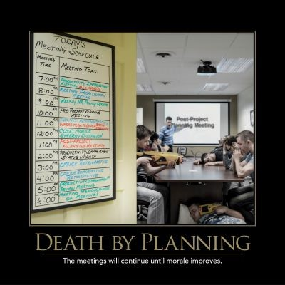

Although planning is an essential part of building quality software, keep in mind that [shipping is a feature](/shipping-is-a-feature) (your product _must_ have it). Keep short term plans as close to the actual implementation of your software as possible, while keeping long term plans as vague and flexible as possible.

Also, keep in mind the expense associated with meetings. If six people who make an average of $60,000 in salary meet for an hour, and their benefits, etc. costs another 30% above that, the meeting costs the company about $225 (assuming 40-hour work weeks, etc.). You can install a [meeting cost app](https://www.google.com/search?q=meeting+cost+app&oq=meeting+cost+app) if you're interested in tracking just how expensive your meetings are.

It's a good idea to minimize how much time is spent on meetings. You can't eliminate them entirely, and the larger your organization, the more time is required to keep everybody on the same page. However, you can keep meetings shorter by having specific agendas, using standing meetings where possible, and minimizing who needs to attend meetings. Just these three simple techniques can make a significant difference. Starting on time and ending on time are also a big help in limiting how much time is wasted by meetings.

## Quotes

"The meetings will continue until morale improves." - Anonymous
