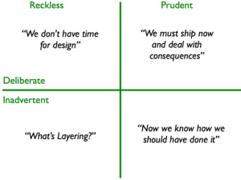
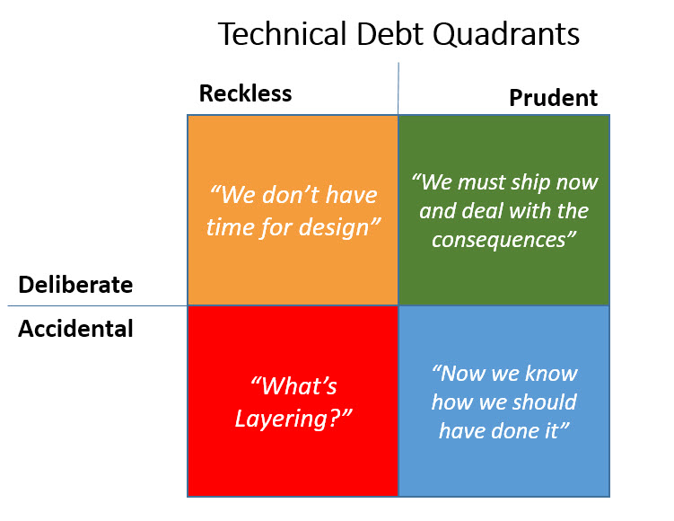

Technical debt is a metaphor for all of the shortcuts, hacks, and poor design choices made for a given software system that compromised its quality, usually in an attempt to meet a deadline. It can be an appropriate business decision to take on technical debt, but if such debt is allowed to grow, the lack of quality of the system may eventually make it too expensive to maintain, at which point the business or team may need to declare "technical bankruptcy" and rewrite the application rather than continue to try to maintain it.

As with financial debt, technical debt must be paid back, and is comprised of two parts: principal and interest. In the software development metaphor, the interest is paid in the form of additional work required to maintain the software system given its sub-optimal code. Time spent improving the code, which isn't directly adding customer value and which wouldn't be necessary if the code were optimally designed currently, represents paying down the principal on the debt. Usually this takes the form of [refactoring](https://www.pluralsight.com/courses/refactoring-fundamentals) the code to improve its design, making it more appropriate to its current requirements and conditions.

The technical debt metaphor was coined by [Ward Cunningham (he explains it here)](http://c2.com/cgi/wiki?WardExplainsDebtMetaphor).

There are different kinds of technical debt, and different reasons why it is incurred. It comes down first to whether or not you know you're incurring debt, and then to the reasons why you might choose to incur it. Martin Fowler refers to this as the [Technical Debt Quadrant](http://martinfowler.com/bliki/TechnicalDebtQuadrant.html) and describes the kinds of debt as Deliberate and Inadvertent, and the choice of taking on debt can be described as Prudent or Reckless.

We can further identify each quadrant by assigning it a color that corresponds with its desirability, where red-orange indicate warning colors and green-blue indicate desirable colors.

Reckless Accidental debt is the least desirable, since the team has no choice about incurring it and either doesn't recognize it or cannot correct it once it exists. This quadrant is red, because ideally the team should stop and self-improve (through training, hiring, or whatever other means is available) such that it is able to at least recognize the kind of debt it is incurring currently. At that point, at least a rational decision can be made about whether or not it is Prudent to continue to incur it.

Reckless Deliberate debt is orange, because it is still (usually, and by definition) _reckless_. This kind of debt occurs when a team knows better, but consciously chooses to make "quick and dirty" updates to a system, usually in the name of speed. This kind of debt mainly applies to long term behavior, as opposed to when an actual, short-term deadline is looming, in which case it may be Prudent to incur debt.

Prudent Deliberate (green) debt represents quality shortcuts made consciously by the team because of an imminent deadline. The team recognizes the issue (and most likely adds correcting it to their backlog) and its consequences, but must choose to deliver something rather than focus on quality at this time.

Prudent Accidental technical debt is blue. It represents actual learning made by the team as work is done on a project. "Hindsight is 20/20" and frequently after completing a feature or project the team will recognize that if they had designed it differently, it might have resulted in a higher quality solution. The difference in quality between the implemented design and the ideal accounts for some accidental technical debt, because the team didn't intentionally create it, but the team's improved understanding of the system makes this fall into the prudent category.

## Quotes

<blockquote class="twitter-tweet" lang="en">Remember, Lines of Code isn't a unit of production or value, it's a Cost and a major component of technical debt.

— Steve Smith (@ardalis) <a href="https://twitter.com/ardalis/status/168048081454104576">February 10, 2012</a></blockquote>

<blockquote class="twitter-tweet" lang="en">Every time you decide not to refactor bad code you've just written, you incur technical debt.

— Code Standards (@codestandards) <a href="https://twitter.com/codestandards/status/573128284608724992">March 4, 2015</a></blockquote>

<blockquote class="twitter-tweet" data-lang="en">
Technical debt: grit in the oil of your agile engine.
— Declan Whelan (@dwhelan) <a href="https://twitter.com/dwhelan/status/780412196018728960">September 26, 2016</a></blockquote>

<blockquote class="twitter-tweet" data-lang="en">
Red and orange! It's red and orange all the way down! <a href="https://twitter.com/hashtag/inheritedcodebase?src=hash">#inheritedcodebase</a> <a href="https://twitter.com/hashtag/slowlylosingmymind?src=hash">#slowlylosingmymind</a> <a href="https://t.co/YmPj7j9YuC">https://t.co/YmPj7j9YuC</a>
— Chris Rodgers (@Christophano) <a href="https://twitter.com/Christophano/status/781141242432421888">September 28, 2016</a></blockquote>

## References

[The Human Cost of Technical Debt](http://www.daedtech.com/human-cost-tech-debt/)

[Refactoring Fundamentals](https://www.pluralsight.com/courses/refactoring-fundamentals) to eliminate common sources of Technical Debt
